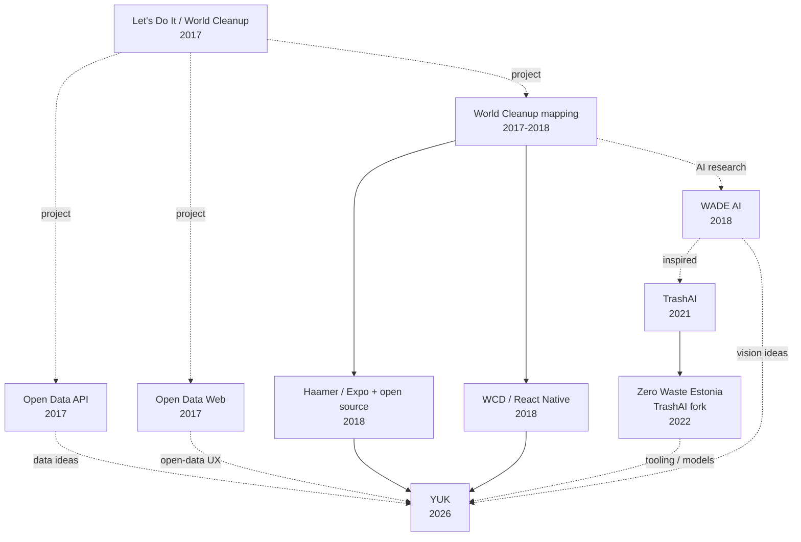

# Project ecosystem

YUK has two different kinds of ancestry, and they should not be confused.

1. **Git ancestry** is literal commit history preserved inside this repository.
2. **Project lineage** is the wider family of Let’s Do It / World Cleanup projects that explored waste data, open data, computer vision and trash classification alongside or after the mobile application.

The strict Git ancestry remains the two preserved 2018 mobile heads documented in [README.md](README.md). The projects below are related product and research lines, not additional parents of the YUK Git repository.

## Wider lineage

In this diagram, the solid paths from the 2018 mobile generations into YUK represent preserved Git ancestry. Dashed paths represent project, research or conceptual inheritance. The TrashAI to Zero Waste Estonia connection is also a real GitHub fork relationship, but it is not part of the YUK repository's commit ancestry.

## Open Data API and Web

- [`zerowasteestonia/opendata-web`](https://github.com/zerowasteestonia/opendata-web) was created on 2017-10-23. Its repository describes itself as the code behind the Let’s Do It World Open Data site. The frontend combines a timeline and map and depends on the Let’s Do It World API.
- [`zerowasteestonia/opendata-api`](https://github.com/zerowasteestonia/opendata-api) was created on 2017-10-24. It identifies itself as the Let’s Do It World Open Data API and contains the PostgreSQL-backed report model, source data and import machinery.

These projects matter to YUK because the new system is not only a capture app. Its long-term architecture also needs a privacy-safe, queryable observational layer that can connect reports, imports, classifications and public aggregate views.

They are therefore **data and product ancestors**, but not Git ancestors of `krishaamer/yuk.wtf`.

## WADE AI

[`zerowasteestonia/wade-ai`](https://github.com/zerowasteestonia/wade-ai) was created on 2018-11-20 and describes itself as an AI algorithm for detecting trash in geolocated images.

Its own README identifies WADE as a Let’s Do It World project. This makes it a particularly direct predecessor to YUK's current camera-first idea: a photo becomes structured evidence about waste, with machine interpretation attached rather than treated as unquestionable truth.

WADE is a **project and research ancestor**, not part of YUK's Git history.

## TrashAI

The WADE repository says WADE was superseded by TrashAI and that TrashAI was initially inspired by WADE.

The later upstream project lives at [`opensacorg/trash-ai`](https://github.com/opensacorg/trash-ai), created in 2021. It provides a web workflow for uploading litter images and using computer vision to detect and categorize litter for research.

[`zerowasteestonia/trash-ai`](https://github.com/zerowasteestonia/trash-ai) is an actual GitHub fork of that upstream repository, created on 2022-09-28.

For YUK, this branch of the family tree represents accumulated experience around image classification, litter taxonomies, research workflows and model-assisted interpretation.

## What YUK recombines

YUK should not describe itself as merely reviving one forgotten mobile app. The more accurate story is that several strands developed around the same problem:

- **field capture:** mobile waste mapping, geolocation, photos and offline operation
- **open data:** APIs, imports, maps and public waste datasets
- **computer vision:** WADE and later TrashAI image interpretation
- **state over time:** cleanups, repeated observations and changing evidence about physical places

YUK recombines those lessons around a newer model: the camera is the easiest input, AI interprets evidence, observations retain provenance and confidence, and the resulting data can contribute to a continuously updated model of waste in the physical world.

## Historical precision

When documenting this ecosystem:

- do not imply every related repository shares commit history with YUK;
- do not imply YUK is a current official Let’s Do It World or World Cleanup Day product;
- use solid ancestry language only for relationships demonstrated by Git history;
- use terms such as project lineage, research lineage, inspiration or conceptual inheritance for the wider ecosystem;
- preserve original project names and repository links so future archaeology remains auditable.
